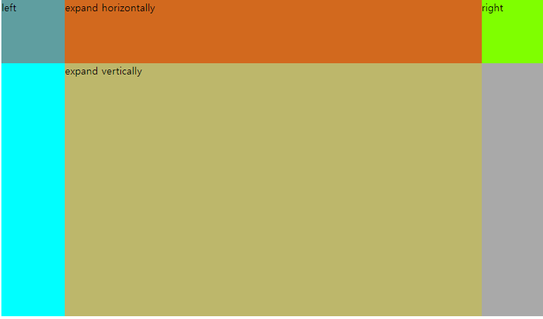

최근 프로젝트를 하면서, 다른 요소들의 크기는 정해져있을때 남은 한 요소의 크기를 부모 요소에서 남는 공간만큼 부여하는 부분이 많았다(그리고 앞으로도 많을 것 같다)

위 부분을 구현할때, flex와 grid를 통해 해결했어서 그것을 기록 하는 차원에서 이 글을 적어본다.

## flex

만약 다음과 같이 div 엘리먼트들이 배치되어있고, 우리는 가운데 expand를 container의 남는 공간만큼 확장 시키고 싶다고 하자.

```css
.container {
  display: flex;
  background-color: burlywood;
}

.leftItem {
  height: 100px;
  width: 100px;
  background-color: cadetblue;
}
.rightItem {
  height: 100px;
  width: 100px;
  background-color: chartreuse;
}
.expandItem {
  width: 100px;
  height: 100px;
  background-color: chocolate;
}
```


만약 expandItem에 `width:100%;`를 주면 어떻게 될까?

```css
...
.expandItem {
  width: 100%;
  height: 100px;
  background-color: chocolate;
}
...
```


위와같이, 확장이 된 모습을 볼 수 있다. 하지만 뭔가 첫번째 사진과 좀 다르지 않는가? left와 right가 첫번째 사진보다 작아보이지 않는가?

자바스크립트로 확인해보자. 다음과 같은 코드로 간단히 left 요소의 너비를 찾아봤다

```javascript
<script>
      window.onload = function () {
        const left = document.getElementById("left");
        console.log(left.getBoundingClientRect());
      };
    </script>
```


결과는 대략 81px. expand 엘리먼트는 다른 요소들의 너비를 침범하여 확장되었다. 이는 실제 UI를 구현할때 상당히 거슬릴 것이다.

그럼 어떤 방법으로 다른 요소를 침범하지 않고 확장이 가능할까?

### flex : 1 0 auto; or flex-grow:1;

제목에서와 같이 `width :100%`말고 `flex : 1 0 auto;`를 expand 엘리먼트에 주어보자.( `flex-grow: 1;`로도 되나, 여기선 예시는 `flex : 1 0 auto;`로 들어본다 )

```css
.expandItem {
  flex: 1 0 auto;
  height: 100px;
  background-color: chocolate;
}
```


자바스크립트 수행결과까지 확인해보니, 제대로 다른 요소를 침범하지 않고 확장되었다.

이와 같은 방법으로 세로 방향일때도 적용이 된다.

```css
.container {
  display: flex;
  width: 100px;
  height: 500px;
  flex-direction: column;
  background-color: burlywood;
}

.leftItem {
  height: 100px;
  width: 100px;
  background-color: cadetblue;
}
.rightItem {
  height: 100px;
  width: 100px;
  background-color: chartreuse;
}
.expandItem {
  flex: 1 0 auto;
  height: 100px;
  background-color: chocolate;
}
```

위와 같이 컨테이너의 높이가 500px이고, 위아래 요소는 100px의 높이를 가질때, expand 엘리먼트에 flex : 1 0 auto를 똑같이 주면 아래와 같이 나온다.


제대로 확장됨을 알 수 있다.

## grid

1. 아래와 같이 속성을 사용하면 된다.(또는 minmax 없이 auto만 사용해도 됨.)

```css
display: grid;
grid-template-columns: 100px minmax(0px, auto) 100px;
grid-template-rows: 100px minmax(0px, auto);
```



2번째 열의 요소들은 수평으로 확장되었고, 2번째 행의 요소들은 수직으로 제대로 확장되었다.


2. 또는 아래와 같이, 확장하고자 하는 부분을 1fr으로 설정하고, 나머지는 auto로 설정하면 나머지는 자신들의 최소 부분만 차지하고 확장하고자하는 부분을 최대로 확장한다. (auto 대신 max-content 를 사용해도 됨)

```css
display: grid;
grid-template-columns: auto 1fr auto;
```

​	


## 주의점

이때 flex를 활용하여 확장을 할때 주의해야할 점이 있다.

바로 확장해야할 요소를 제외한 요소는 크기가 필요한만큼은 정해져 있어야 한다는 점이다. 그렇지 않으면 expand 요소는 최대한으로 커질 것으로, 그 뜻은 아래 사진과 같이 크기가 정해져있지 않은 요소의 크기는 최소로 정한다는 말이다.


따라서 만약 다른 요소들의 크기를 어느정도는 여유있게 확보해야한다면, 크기를 정해주어야한다.
