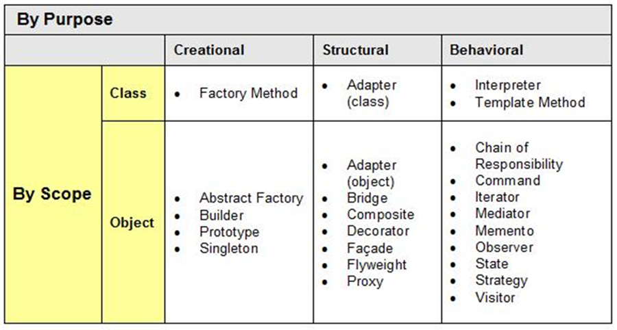

## **GoF(Gang of Four)**

GoF에서는 23가지 디자인패턴을 3가지 유형으로 분류함.

1. 생성 패턴(Creation pattern)
   - **객체를 생성**하는데 관련된 패턴들
   - 객체가 생성되는 과정의 유연성을 높이고, 코드의 유지를 쉽게함
2. 구조 패턴(Structural Pattern)
   - **프로그램 구조**에 관련된 패턴들
   - 프로그램 내의 자료구조나 인터페이스 구조 등 프로그램의 구조를 설계하는데 활용할 수 있는 패턴들
3. 행동 패턴(Behavioral Pattern)
   - **반복적으로 사용되는 객체들의 상호작용**을 패턴화 해놓은 것들

주요 패턴

- 생성 패턴
  - 클래스 : 팩토리 메서드 패턴
  - 객체 : 프로토타입 패턴, 싱글톤 패턴, 빌더 패턴
- 구조 패턴
  - 객체 : 어댑터 패턴, 컴포지트 패턴, 데코레이터 패턴, 퍼사드패턴, 프록시 패턴
- 행동 패턴
  - 객체 : 옵저버 패턴, 커맨드 패턴, 책임 연쇄 패턴, 중재자 패턴, 방문자 패턴
