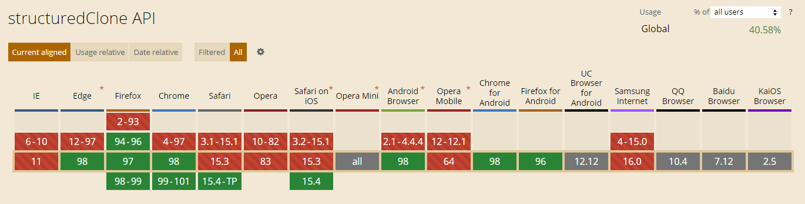
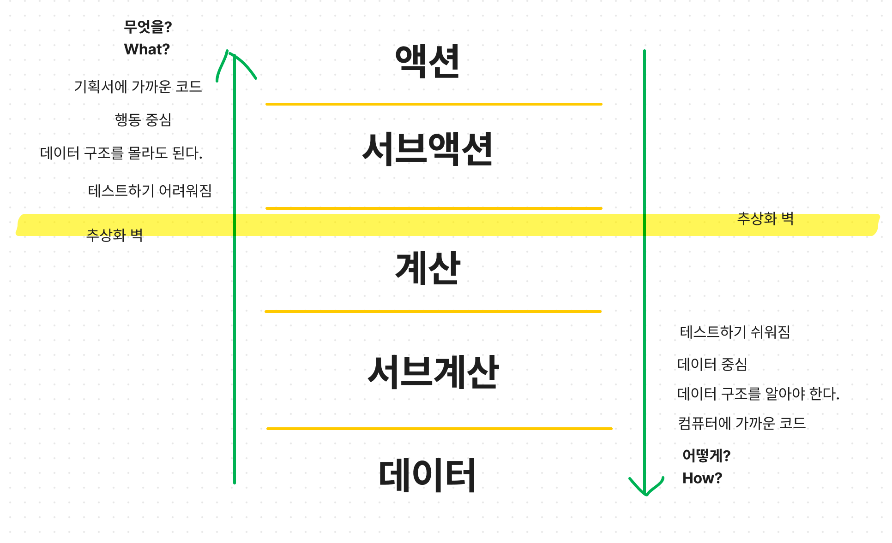

## 액션, 계산, 데이터

순수함수 vs 부수효과를 대체한 개념들.

`데이터` : 이벤트에 대한 사실. 액션에 의해 변화됨

`액션` : 데이터를 변화시킬 수 있음. 실행시점이나 횟수에 의존하여 언제하느냐에 따라 결과가 달라지면 액션이다.

`계산` : 입력값을 통해 출력을 만들어내는 것. 같은 입력에 대해 항상 같은 출력값만 내놓아야한다. 외부 세계에 영향을 주면 안됨.

함수형 프로그래밍 예시)

```js
// 함수형 프로그래밍 관점에서 분리해보자.
function App() {
  // 데이터
  const [count, setCount] = useState(0);

  // 계산
  const increase = (value) => value + 1;

  // 액션
  const onClick = () => setCount(increase(count));

  // 선언적 패턴
  return <button onClick={onClick}>{count}</button>;
}
```

- 액션과 계산을 분리해야함. 계산은 외부세계에 영향을 주지 않고, 같은 입력에 같은 출력이 나오는 함수(순수함수)

더 좋은 예시) 계산함수를 아래처럼 변경

```js
const increase = (value, offset) => value + offset;
```

- 암묵적 입출력을 없애도록 함.
- 언제든 재사용이 가능하며 테스트하기에도 용이하다.

## 불변성 - 카피온라이트, 방어적복사

### 카피온라이트(얕은 복사)

버튼 클릭시 배열의 값을 하나씩 늘려간다고 해보자.

```js
const increase = (arr) => {
  const value = arr[arr.length - 1];
  arr.push(value + 1);
  return arr;
};
```

자바스크립트에서는 `pass by reference`로 동작하기 때문에, 위처럼 코드를 짜게 되면 원본이 변화한다. 따라서 다음과 같이 원본을 복사하여 사용하여야 불변성을 지킬 수 있다.

```js
const increase = (arr) => {
  arr = arr.slice(); // array를 조작하기 전에 복사해서 사용한다.
  const value = arr[arr.length - 1];
  arr.push(value + 1);
  return arr;
};
//or
const increase = (arr) => [...arr, arr[arr.length - 1]];
```

### 방어적복사

만약 계산이나 액션 중에 우리가 수정할 수 없는 라이브러리를 사용한다면 어떻게 불변성을 지킬 수 있을까?

이때는 방어적 복사를 사용한다.

다음과 같이 `structuredClone()` 이라는 최근 JS에 추가된 API를 사용하여 구현할 수 있다.

```js
const someCalcuation = (obj, value) => {
  const clone = structuredClone(obj); // 완전한 clone을 만들어 낸다.
  someActionLibray(clone, value); // clone값을 변경해도 원본은 변하지 않는다.
  return clone;
};
```

참고) structuredClone 지원 브라우저 목록



IE에서는 polyfill 에서 지원

## 선언적 패턴과 계층형 구조

### 계층적 구조

데이터, 액션, 계산으로 구조를 나누면 자연스럽게 코드 구조에 계층이 생기게 되고, **좋은 설계와 쉬운 리팩토링이 보장됨.**



액션으로 갈수록 코드는 무엇을 할지에 대한 기획서에 가까운 코드가 되고, 데이터에 가까워질수록 데이터 중심적 코드를 작성하게 되고, 상대적으로 재사용성이 높고 테스트하고 쉬운 코드가 나오게 된다.

이렇게 계층을 나누고, 각 계층을 침범하지 않도록 코드를 짜다보면 자연스럽게 `추상화벽`이 만들어지면서 벽 상단으로의 코드변화가 하단에는 영항을 미치지 않고, 하단의 변화도 상위에 영항을 주지 않도록 할 수 있다.

이렇게되면 상위에서는 무엇을 할지 기술하는 **선언적 패턴**으로 코드를 작성할 수 있고, 하위에서는 **테스트 하기 쉬운 코드 조각**들로 이루어질 수 있다.

## 함수형 프로그래밍을 돕는 라이브러리들

[lodash](https://lodash.com/) : 데이터의 필수적인 구조를 쉽게 다룰 수 있게끔 도와줌. [설명](https://velog.io/@kysung95/%EC%A7%A4%EB%A7%89%EA%B8%80-lodash-%EC%95%8C%EA%B3%A0-%EC%93%B0%EC%9E%90) lodash/fp 로 함수형 프로그래밍을 지원하는듯

[rambda](https://selfrefactor.github.io/rambda/#/)

[rxjs](https://rxjs.dev/) : 이벤트 기반 프로그래밍에서 함수형 프로그래밍을 이용해 선언적으로 이벤트를 처리할 수 있도록 해줌. [설명](https://min9nim.vercel.app/2020-04-24-rxjs/)

redux

[immutable](https://immutable-js.com/) : Map, List 등의 새로운 객체를 제공하여, 변화가 일어나는 구조체는 새로만들고 나머지는 재사용하는 방식으로 불변성을 지킨다. [설명](https://pks2974.medium.com/immutable-js-%EA%B0%84%EB%8B%A8%EC%A0%95%EB%A6%AC-bbd5ad20bbdf)

[date-fns](https://date-fns.org/) : 날짜 관련 라이브러리. 함수형프로그래밍을 지원하는 모듈이 있음.

## 출처

https://velog.io/@teo/functional-programming
