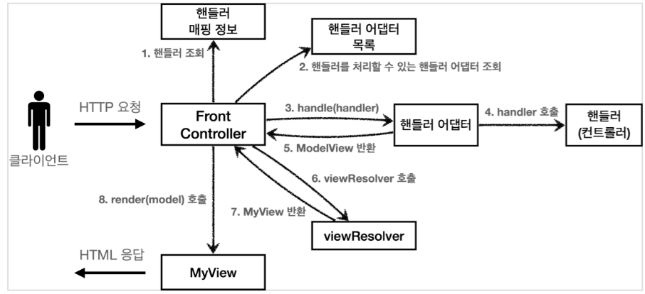

## 스프링 MVC 구조

**과정**

1. 클라이언트가 서버로 요청하면 먼저 Dispatcher Servlet 받음
2. Dispatcher Servlet은 http 요청의 URL과 메소드를 보고 이것을 처리할 수 있는 핸들러(컨트롤러)를 찾기 위해 `핸들러 매핑` 과정을 진행한다.
3. 핸들러를 찾으면 이 핸들러를 처리할 수 있는 `핸들러 어댑터`를 조회한다.
4. 핸들러 어댑터를 실행시킨다. 핸들러 어댑터는 요청을 적절히 처리한 다음 핸들러를 호출한다.
5. 핸들러는 작업을 완료한 후 핸들러 어댑터에게 작업 결과를 반환한다.
6. 핸들러 어댑터는 이 결과를 가공하여 `ModelAndView`로 만들어 Dispatcher Servlet에게 반환해준다.
7. Dispatcher Servlet은 ModelAndView의 view name을 가지고 `viewResolver` 를 호출한다.
8. viewResolver는 View를 반환해준다.
9. Dispatcher Servlet에서는 View의 render 메소드를 model을 넣어주며 호출해준다.
10.   이후 HTML이 응답으로 클라이언트에게 간다.

 

스프링 MVC는 위와 같이 매우 많은 과정을 거쳐 동작하지만, 개발자는 핸들러를 구현하고 이를 매핑 시켜주는 것만해주면 스프링 프레임워크에서 나머지를 알아서 해준다.

 

**Dispatcher Servlet 구조**

-  `HttpServlet`을 상속 받아서 사용하고, 서블릿으로 동작한다.
-  스프링 부트는 Dispatcher Servlet 을 서블릿으로 자동으로 동록하며 모든 경로(`urlPatterns="/"`)에 대해 매핑한다.
-  클라이언트의 요청을 받고 서블릿이 호출되면, `HttpServlet`이 제공하는 `service()`가 호출된다. Dispatcher Servlet의 부모인 `FrameworkServlet`은 `service()`를 오버라이드 해두었다. `FrameworkServlet.service()`를 시작으로 여러 메서드가 호출되면서 `DispatcherServlet.doDispatch()`가 호출되고 위 과정을 시작한다.

 

**스프링 부트가 자동 등록하는 핸들러 매핑과 핸들러 어댑터**

HandlerMapping

0. RequestMappingHandlerMapping : 애노테이션 기반의 컨트롤러인 @RequestMapping에서 사용
1. BeanNameUrlHandlerMapping : 스프링 빈의 이름으로 핸들러를 찾는다.

HandlerAdapter

0. RequestMappingHandlerAdapter : 애노테이션 기반의 컨트롤러인 @RequestMapping에서 사용
1. HttpRequestHandlerAdapter : HttpRequestHandler 처리
2. SimpleControllerHandlerAdapter : controller 인터페이스 처리

핸들러 매핑과 핸들러 어댑터는 이 순서대로 찾고, 없으면 다음 순서로 넘어간다.

 

**스프링 부트가 자동 등록하는 뷰 리졸버**

(이외에도 존재함)

1. BeanNameViewResolver : 빈 이름으로 뷰를 찾아서 반환한다.
2. InternalResouceViewResolver : JSP를 처리할 수 있는 뷰를 반환함.

 

출처 : 김영한의 스프링 강의
