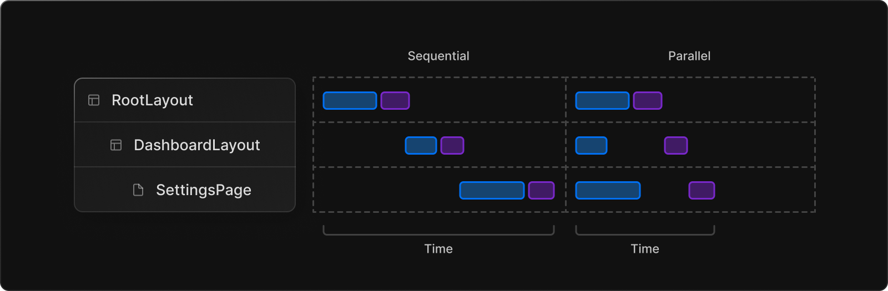

# AppDir

next.js에서 layout과 routing 경험을 개선시키고 React 최신 기술을 지원하기위해, next.js 13부터 지원하는 디렉터리 방식. 기존의 `pages` 디렉터리를 대체한다. 

23년 04월 기준으로 아직은 베타버전으로 프로덕션에서 사용하는 건 추천하지 않는다고 한다. 하지만, 좋은 기능들이 많기에 학습해봐도 괜찮을 거 같다.

## file conventions

app directory에서 파일 컨벤션은 다음과 같다.

- page.js : 해당 path의 UI를 담당하며, public하게 접근할 수 있도록 함.
  - route.js : 서버 사이드 API endpoint<br/>
- layout.js : route segment 간에 공유 가능한 UI. 자식 layout, page를 감쌈
  - template.js : layout 아래에서 자식 layout, page를 감쌈.
- loading.js : 페이지를 로딩 중일 때 보여주는 UI. 페이지나 child segment를 React Suspense로 감싼다.
- error.js : page나 child segment에서 에러가 발생했을 경우 보여줌. React Error Boundary 사용.
  - global-error.js : root layout에서 에러를 잡았을 때 보여주는 UI
- not-found.js : 해당 route segment 아래에서 매치되는 route가 없을 때 보여주는 UI 

<br/>

## Layout

next.js 13부터는 path가 바뀌더라도 리렌더링 없이 이전 레이아웃을 유지할 수 있다. 이때 상태도 유지된다. 

사용법은 다음과 같다.

1. app directory를 사용한다.
2. 특정 페이지 아래에서 어떤 파일을  `layout.js`로 생성하면, 그것이 레이아웃 컴포넌트이다.

```react
// app/dashboard/layout.ts
export default function DashboardLayout({
  children, // will be a page or nested layout
}: {
  children: React.ReactNode,
}) {
  return (
    <section>
      {/* Include shared UI here e.g. a header or sidebar */}
      <nav></nav>

      {children}
    </section>
  );
}
```

참고

- 모든 route segment는 자신만의 layout을 가질 수 있다. 이 layout은 그 segment 아래의 모든 페이지에 적용된다.
- layout은 디폴트로 nested된다. 각 부모 layout은 자식 layout을 감싼다. 
- Route Groups를 지정하여 특정한 route segment에만 layout을 공유할 수도 있다.
- Layout은 디폴트로 Server Component이다. 다만 Client Component로 설정할 수 있다.
- 부모 자식 layout 간에 데이터를 주고 받는건 불가능하다. 하지만, 같은 데이터를 fetch 하면 리액트에서 자동으로 요청을 중복제거한다.
- `layout.js`와 `page.js`를 같은 폴더에 생성할 수 있다. `layout.js`가 `page.js`를 감싼다.

### Root Layout (Required)

app directory의 최상단에 반드시 있어야함. 이 root layout을 통해 클라이언트에서 최초에 받는 HTML을 수정할 수 있다. (`pages` 디렉터리에서의 `_document.js` 같은 느낌)

참고

- `<html>`, `<body>`를 반드시 가지고 있어야한다.
- `<head>`를 수정하여 SEO를 지원할 수 있음.
- Route Group을 사용하여 여러 root layout을 가질 수 있음.
- root layout은 서버컴포넌트로, 클라이언트 컴포넌트로 설정할 수 없다.

### template

layout과 같이 child layout, page를 감싸지만, routing에 거쳐 상태가 유지되지않는다. path가 변경되면 리렌더링된다.  사용하려면, route segment에 `template.js`로 생성하면 된다. 그럼 다음과 같이 layout 아래에서 자식 컴포넌트를 감싸도록 적용된다.

```react
<Layout>
  {/* Note that the template is given a unique key. */}
  <Template key={routeParam}>{children}</Template>
</Layout>
```

<br/>

## Server component

app directory를 사용하면, 서버컴포넌트를 간편하게 사용할 수 있다. 서버컴포넌트를 사용하면, 클라이언트에게 최초로 보내지는 JS 코드를 줄일 수 있어 빠른 페이지로딩에 도움을 준다.

app directory 아래에 있는 모든 컴포넌트는 기본적으로 서버컴포넌트이다. 따라서 서버컴포넌트를 사용하기 위해 별다른 작업이 필요없다. 

route가 next.js에서 로딩되면, 최초의 HTML은 서버에서 렌더링 된다. 그리고 그 HTML는 점진적으로 브라우저에 전달된다. 이때 next.js와 react client-side runtime을 비동기적으로 로딩한다. 이로써 클라이언트가 어플리케이션을 다루고, 인터랙션할 수 있게 된다.

서버컴포넌트를 사용하면 최초 페이지 로딩은 빨라지고, client-side runtime은 캐시될 수 있으며 사이즈를 예측할 수 있다.  그리고 이 최초로 내려지는 JS 번들 사이즈는 어플리케이션 크기가 커지는만큼 따라 커지지 않는다. 클라이언트 컴포넌트를 통해 어플리케이션에 추가된 client-side interactivity만큼만 증가하게 된다.  

app directory에서 network boundary는 서버 컴포넌트냐, 클라이언트 컴포넌트냐에 달려있다. pages directory에서는 `getStaticProps`, `getServerSideProps`에 달려있다.

### Client Component

next.js에서 클라이언트 컴포넌트는 서버에서 prerender 되고 클라이언트에서 hydration 된다. `pages/` 디렉터리에서 동작하는 방식이다. app 디렉터리에서는 다음과 같이 파일 상단에 `"use client";`를 작성하면 클라이언트 컴포넌트가 된다.

```js
'use client';
import { useState } from 'react';

export default function Counter() {
  const [count, setCount] = useState(0);

  return (
    <div>
      <p>You clicked {count} times</p>
      <button onClick={() => setCount(count + 1)}>Click me</button>
    </div>
  );
}
```

이때 클라이언트 번들로 포함되는 컴포넌트들은 다음과 같다.

- `"use client";`가 작성된 컴포넌트 
- `"use client";`가 작성된 컴포넌트에 import된 모든 컴포넌트들
- 자식컴포넌트

따라서 클라이언트 컴포넌트를 사용할 때는 최대한 말단 컴포넌트에서 사용할 것을 추천하고 있다. 

### when to use server component vs client component?

next.js 팀에서는 서버 컴포넌트를 기본으로 사용하다가 클라이언트 컴포넌트는 필요할 때만 사용할 것을 추천한다. 그럼 언제 클라이언트 컴포넌트가 필요할까?

- interactivity나 event listener(onClick(), onChange() 등)가 필요할 때.
- lifecycle effect나 state가 필요할 때
- browser-only API를 사용할 때
- state, effect, browser-only API에 의존하는 custom hook을 사용할 때
- React Class Component를 사용할 때

### 클라이언트 컴포넌트에서 서버컴포넌트 사용하기

리액트에서 클라이언트 컴포넌트안에 서버컴포넌트를 importing 하는 건 제약이 있다. 서버 컴포넌트는 server-only code 이기 때문이다. 따라서 다음과 같이 클라이언트 컴포넌트에선 서버 컴포넌트를 import할 수 없다.

```js
'use client';

// ❌ This pattern will not work. You cannot import a Server
// Component into a Client Component
import ServerComponent from './ServerComponent';

export default function ClientComponent() {
  return (
    <>
      <ServerComponent />
    </>
  );
}
```

하지만 클라이언트 컴포넌트에 props로 넘기는 것은 가능하다

```js
'use client';

export default function ClientComponent({children}) {
  return (
    <>
      {children}
    </>
  );
}
```

```js
// ✅ This pattern works. You can pass a Server Component
// as a child or prop of a Client Component.
import ClientComponent from "./ClientComponent";
import ServerComponent from "./ServerComponent";

// Pages are Server Components by default
export default function Page() {
  return (
    <ClientComponent>
      <ServerComponent />
    </ClientComponent>
  );
}
```

이렇게 사용하면 리액트는 클라이언트 컴포넌트로 child를 넘기기 전에 `<ServerComponent/>`를 서버에서 렌더링해야한다는 것을 안다. 클라이언트 컴포넌트의 입장에서는 child 가 이미 렌더링 되어있다. layout이 이 방식으로 구현되어있다.

### passing props from server to client component

서버 컴포넌트에서 클라이언트 컴포넌트로 props를 넘길 땐 serialization 될 필요가 있다. function, Date 등은 직접 클라이언트 컴포넌트로 넘길 수 없다는 것이다.

### server-only code가 클라이언트 컴포넌트에서 실행되는 것을 막는 방법

`server-only` 패키지를 사용하여, 서버에서만 실행되어야하는 코드가 클라이언트 컴포넌트에서 사용되면 build-time error를 내도록 할 수 있다.

```js
import "server-only";

export async function getData() {
  let resp = await fetch("https://external-service.com/data", {
    headers: {
      authorization: process.env.API_KEY,
    },
  });

  return resp.json();
}
```

마찬가지로 `client-only` 패키지도 제공한다. 이 패키지는 `window` 객체를 사용하는 함수와 같이 클라이언트에서만 사용되어야하는 함수에서 사용할 수 있다.

### third party packages

현재 많은 서드파티 패키지들은 `useState` 등을 사용함에도 `use client`를 붙이지 않은 경우가 많다. 이러한 서드파티 패키지를 클라이언트 컴포넌트에서 사용하는 것은 큰 문제가 없다. 클라이언트 컴포넌트에 이미 `use client`가 붙어있기 때문이다. 하지만 서버 컴포넌트에서 사용할 땐 오류가 뜰 것이다. 따라서 서버 컴포넌트에서 사용할 경우엔 다음과 같이 서드파티 패키지를 감싸고 사용하면 된다.

```js
'use client';

import { AcmeCarousel } from 'acme-carousel';

export default AcmeCarousel;
```

```js
import Carousel from './carousel';

export default function Page() {
  return (
    <div>
      <p>View pictures</p>

      {/* 🟢 Works, since Carousel is a Client Component */}
      <Carousel />
    </div>
  );
}
```

### data fetching

클라이언트 컴포넌트에서도 data feching은 할 수 있지만, 가능한 서버 컴포넌트에서 하는 것이 성능상 좋다.

### context

클라이언트 컴포넌트에서는 context나 provider를 사용하여 context를 공유할 수 있다. 하지만, 서버 컴포넌트에서는 react state를 가지고 있지 않고, context는 보통 리렌더링할 때 필요하기 때문이다. 

따라서 next.js 팀은 서버 컴포넌트 간에 데이터 교환을 위해 native javascript 패턴을 제안한다. 예를들어 만약 여러 서버 컴포넌트 사이에서 DB connection을 공유해야한다면 다음과 같이 사용할 수 있다.

```js
// utils/database.js
export const db = new DatabaseConnection(...);
```

```js
// app/users/layout.js
import { db } from "@utils/database";

export async function UsersLayout() {
  let users = await db.query(...);
  // ...
}
```

```js
// app/users/[id]/pages.js
import { db } from "@utils/database";

export async function DashboardPage() {
  let user = await db.query(...);
  // ...
}
```

한편, 서버 컴포넌트에서 fetch 요청을 자동으로 중복제거된다. 따라서 fetch request result를 어떻게 공유할지는 걱정하지 않아도 된다. revalidate 등은 어떻게 하는지는 밑에 data fetching 섹션에서 다룬다.

<br/>

## Support for data fetching

`fetch` Web API는 React와 next.js에서 확장되었다. 

- React에서는 automatic request deduping을 위해 fetch를 확장하였다.
- next.js에서는 options를 확장하여 caching/revalidating 규칙을 설정하였다. 

이를 통해 next.js에서는 하나의 API로 SSG, SSR, ISR을 사용가능하다. ([fetch에 대해서](https://beta.nextjs.org/docs/data-fetching/fetching))

```js
// This request should be cached until manually invalidated.
// Similar to `getStaticProps`.
// `force-cache` is the default and can be omitted.
fetch(URL, { cache: 'force-cache' });

// This request should be refetched on every request.
// Similar to `getServerSideProps`.
fetch(URL, { cache: 'no-store' });

// This request should be cached with a lifetime of 10 seconds.
// Similar to `getStaticProps` with the `revalidate` option.
fetch(URL, { next: { revalidate: 10 } });
```

next.js에서는 웬만하면 서버 컴포넌트에서 data fetching 수행을 권장한다. 다음과 같은 이점이 있기 때문이다.

- 데이터 리소스로의 직접 접근
- API key와 같은 민감한 정보의 노출 예방
- data fetching과 render가 같은 환경에서 이루어짐. 따라서 클라이언트와 서버 사이의 통신이 줄어든다.
- multiple data fetching을 하나의 round-trip으로 실행한다. 클라이언트에서 개별적으로 이루어지는 것과 다르다.
- 클라이언트-서버 waterfall을 줄임
- 서버가 데이터 리소스에 가까이 있다면 성능 향상의 효과가 있음.

클라이언트 컴포넌트에서도 data fetching은 가능하지만, 그때는 SWR나 React Query 사용을 추천하고 있다. 향후 React의 `use()` hook을 사용할 수도 있다고 한다.

### component-level data fetching

컴포넌트에서 data fetching을 수행할때 두가지 모델이 있다.

- parallel : route 내 request가 동시에 이루어진다. 이는 client-server waterfall을 줄이며 데이터 로딩에 걸리는 총 시간을 줄인다.
- sequential : route 내 request가 순차적으로 이루어진다. 하나의 요청이 다른 요청에 의존적일때 사용할 수 있다.



또한 위에 언급했듯이 `fetch()`은 자동으로 deduping 된다. 만약 트리내 여러 컴포넌트에서 같은 데이터를 원한다면, next.js는 자동으로 fetch request(GET)를 캐싱하고 같은 요청이 발생하면 저장했던 것을 돌려준다.

- 서버에서는 렌더링 프로세스가 종료될때까지 캐시가 유지된다.
  - 이는 Layout, Page, Server Component, generateMetadata, generateStaticParams에서 작성된 `fetch` 요청에 적용된다.
  - [static generation](https://beta.nextjs.org/docs/rendering/fundamentals#static-rendering) 동안에도 적용된다.
- 클라이언트에서는 세션 동안 캐시가 유지된다.

만약 `fetch()` 를 사용할 수 없는 상황이라면 [cache](https://beta.nextjs.org/docs/data-fetching/caching#per-request-caching) function을 사용해도 된다.

### static and dynamic data fetches

두가지 타입의 데이터가 존재한다.

- static data : 자주 변경되지 않는 데이터
- dynamic data : 자주 변경되거나 유저 별로 다른 데이터

기본적으로 next.js에서는 static fetch를 한다. 이는 빌드타임에 fetch되어 캐시되고 각 요청마다 사용한다는 말이다. 하지만 dynamic fetch를 해야할 때도 있는데, next.js는 캐시를 무효화하거나 revalidating 하는 방법을 제공한다.

- 캐시 무효화

```js
fetch(URL, { cache: 'no-store' });
```

- revalidating

  - background : time interval을 주어 주기적으로 다시 fetch

    ```js
    fetch(URL, { next: { revalidate: 10 } });
    ```

  - on-demand : update가 있을 때마다 refetch ([예제](https://beta.nextjs.org/docs/data-fetching/revalidating#on-demand-revalidation))

next.js에서는 **Streaming**과 **Suspense**에 대한 지원도 잘 되어있다. Layout 섹션에서 보았듯이 화면의 일부는 즉시 내려보내고, 일부는 비동기적으로 [loading](https://beta.nextjs.org/docs/routing/loading-ui) 화면을 보여주었다가 data fetching이 완료되면 내려보낸다. 이를 통해 유저는 페이지의 모든 부분을 로드할 필요가 없다.

### caching data

> The **Next.js Cache** is a persistent [HTTP cache](https://developer.mozilla.org/en-US/docs/Web/HTTP/Caching) that can be globally distributed. This means the cache can scale automatically and be shared across multiple regions depending on your platform (e.g. [Vercel](https://vercel.com/docs/concepts/next.js/overview)).

next.js는 `fetch()`의 options 객체를 확장하여 서버에서 이루어지는 각 요청이 persistent caching 동작이 이루어지도록 설정할 수 있다. 이를 통해 데이터를 사용하는 어플리케이션 코드에서 캐싱 동작을 설정할 수 있다.


<br/>

## 출처

https://beta.nextjs.org/docs/routing/fundamentals