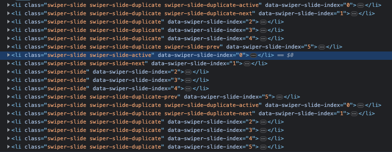
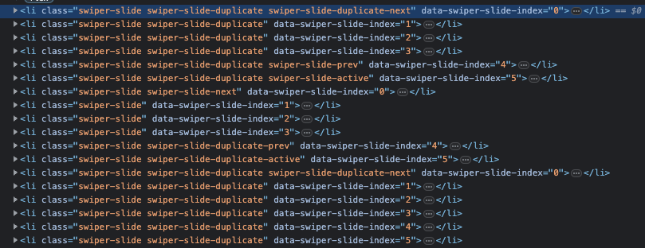

다음과 같은 요구사항을 가지는 웹페이지를 개발하고 있었다.

- swiper로 여러 슬라이드를 띄움
- 슬라이드 내에는 영상이 존재하고, 각 영상은 자동으로 재생되어야함.

단순히 swiper를 연동하고 video 태그에 `autoplay` 속성을 주면 될거라 생각하여 다음과 같이 코드를 작성했었다.

```html
<li className="swiper-slide">
        <video
            poster="poster 주소"
            autoPlay muted playsInline loop>
            <source
                src="영상주소"
                type="video/mp4"/>
        </video>
</li>
<li className="swiper-slide">
        <video
            poster="poster 주소"
            autoPlay muted playsInline loop>
            <source
                src="영상주소"
                type="video/mp4"/>
        </video>
</li>
...
```

실제로 당시 개발 환경(mac, chrome)에서는 문제없이 동작했었다. 하지만 QA 단계에서 영상이 재생되지 않으며 사이트 자체가 매우 느리다는 제보를 받았다. 그리고 이 문제를 해결한 과정은 다음과 같다.

<br/>

## 필요한 영상들만 재생

swiper에서 loop 옵션을 사용하고 있었다. 끝까지 가면 다시 처음 슬라이드가 나오도록 하기 위해서였다. 하지만, loop 옵션을 사용하면 다음과 같이 실제로 보여질 `swiper-slide` 앞 뒤로 `swiper-slide-duplicate`를 생성한다. 그리고 각  `swiper-slide-duplicate`는 `slide-swiper`와 구성이 같다.



즉, 필요한 슬라이드 개수의 3배 정도 슬라이드가 만들어지고, 각 슬라이드 안에는 영상이 포함되어있다는 것이다. 이처럼 많은 영상을 한번에 재생하는 것은 사이트 성능에 악영향을 줄거라 생각했다. 따라서 다음과 같이 swiper에 옵션을 주어 `swiper-slide-duplicate` 안에 있는 비디오의 재생은 멈추었다.

```js
new Swiper('.myswiper1', {
            touchRatio: 0,
            autoHeight: true,
            speed: 650,
            observer: true,
            observeParents: true,
            slidesPerView: 'auto',
            loop:true,
            navigation: {
                nextEl: '.swiper-button-next',
                prevEl: '.swiper-button-prev',
            },
            on: {
                slideChangeTransitionEnd : function() {
                    $('.myswiper1 .swiper-slide.swiper-slide-duplicate')
                      .find(".video_box video")?
                      .each(function(idx, item) {
                        item.pause();
                    })
                },
            },
        });
```

하지만 이렇게 하니 `마지막 -> 첫번쨰`, `첫번쨰 -> 마지막`으로 갈때 이동한 후 슬라이드의 영상이 재생되지 않는 것을 발견했다. 그 이유는 앞 두 경우에는 `swiper-slide-duplicate`가 화면에 보이는 경우였기 떄문이다. 다음 사진을 보면 `swiper-slide-active`가 `swiper-slide-duplicate`에 붙은 걸 확인할 수 있다.

 

따라서 다음과 같이 이벤트를 수정하여 `swiper-slide-active`가 붙은건 명시적으로 실행해주어 문제를 해결했다.

``` js
new Swiper('.myswiper', {
            touchRatio: 0,
            autoHeight: true,
            speed: 650,
            observer: true,
            observeParents: true,
            slidesPerView: 'auto',
            loop:true,
            navigation: {
                nextEl: '.swiper-button-next',
                prevEl: '.swiper-button-prev',
            },
            on: {
                slideChangeTransitionEnd : function() {
                    $('.myswiper .swiper-slide.swiper-slide-duplicate')
                      .find(".video_box video")?
                      .each(function(idx, item) {
                        item.pause();
                    })
                    $('.myswiper .swiper-slide.swiper-slide-active')
                      .find(".video_box video")?
                      .each(function(idx, item) {
                       item.play()
                    });
                },
            },
        });
```

이렇게 꼭 필요한 영상들만 자동재생을 적용하니 사이트가 빨라졌다는 답변을 받을 수 있었다.

<br/>

## 영상 최적화

위에서 슬라이드가 복사되는 것을 보고 영상이 너무 많아서 사이트가 느려지고 자동재생이 안되는게 아닐까라는 생각이 들었다. 따라서 영상 자체를 최적화하였다.

- 영상 압축
- 필요한 사이즈로 줄이기
- 음성은 필요없으므로 음성 제거

위 세가지 작업을 진행하니 영상 사이즈를 90%정도 줄일 수 있었다.

그리고 사이트가 빨라졌으며 자동재생이 안되는 문제도 크게 개선되었다는 답변이 왔다. 

하지만 여전히 자동재생은 가끔씩 안되고 있다는 애기를 들었다.

<br/>

## 수동으로 영상 실행

최종 수단으로 chatGPT에게 물어보니 다음과 같은 코드를 실행해보라는 답변을 받았다. 간헐적으로 영상이 자동 재생이 안되면 네트워크 이슈를 비롯하여 다양한 이슈가 있을 수 있으므로 수동으로도 영상을 실행해보라는 얘기였다.

```js 
function playVideo() {
	var videos = document.querySelectorAll('video');
	for (var i = 0; i < videos.length; i++) {
		videos[i].play();
	}
}
playVideo();
window.addEventListener('load', playVideo);
```

실제로 적용해보니 영상이 제대로 재생되었다..

