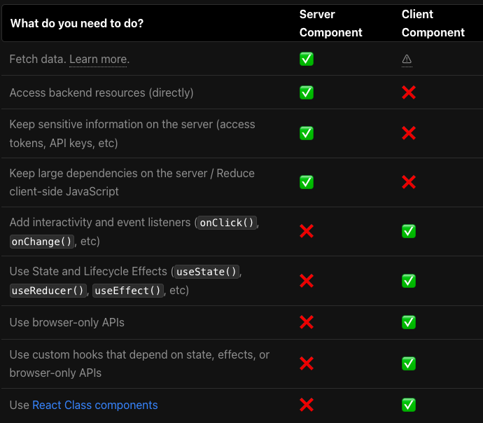

## app directory

Layout으로 레이아웃 잡고, 데이터 필요없는 거 먼저 렌더

streaming으로 데이터 필요한 컴포넌트 렌더

streaming에 사용하는 컴포넌트는 Server component (+ async Server component)

https://nextjs.org/blog/next-13#layouts

- https://beta.nextjs.org/docs/routing/fundamentals

https://nextjs.org/blog/next-13#streaming

- https://beta.nextjs.org/docs/data-fetching/fundamentals

서버 컴포넌트

- app dir 밑의 컴포넌트는 뭐든 RSC임. 따라서 별도의 작업이 필요없음.
- 클라이언트 컴포넌트를 사용하는 방법도 편함. 
- 아직 베타라 사용은 안하지만 내용은 좀 더 자세히 공부해봐도 좋을 거 같다.
- 

## turbopack

## next/image

Lighthouse 검사 결과 이미지, 영상 로딩속도가 문제였음. 

최신 포맷을 사용하는 걸 추천했는데,  next/image 컴포넌트를 사용하라는 조언을 받음. 자동으로 모던 웹 포맷을 사용한다고.

그런데 브라우저 호환성 문제도 있기에 그 부분에서 조사가 좀 더 필요함.

이미지를 주소로 불러오는 경우, width/height를 지정하든가 fill 속성을 사용해야함.

but, 마크업을 받아서 사용하는 입장에서 css를 조작하기엔 부담스러워서 안쓰고 있다.

## OG Image Generation

https://nextjs.org/blog/next-13#og-image-generation